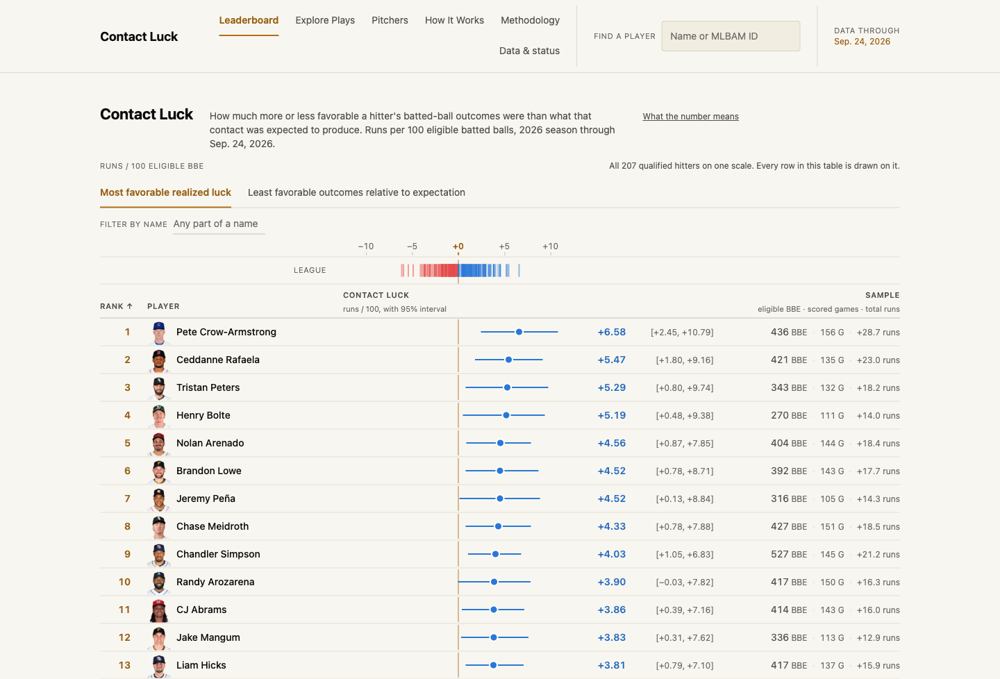

# Contact Luck

[](https://github.com/aaneja121/contact-luck/actions/workflows/publish-prospective.yml)

Contact Luck is an MLB batted-ball metric that measures the difference, in run value,
between what a batter's contact was expected to produce and what actually occurred. It
decomposes realized outcomes across contact, outfield defense, infield defense, and
batter-runner advancement, and reports every figure with a game-clustered 95% uncertainty
interval. The public metric is Contact Luck Runs per 100 Eligible Batted Balls. The system
was fit on 2021-2023, selected on 2024, frozen for a one-time sealed evaluation on 2025,
and now scores 2026 prospectively. It is a retrospective description of realized outcomes,
not a projection of future performance.

**Live dashboard: [contactluck.com](https://contactluck.com)**

[](https://contactluck.com)

## Architecture

The daily loop is one scheduled workflow wrapping one orchestration script. Every stage
fails closed, and a failure stops every stage after it.

```
GitHub Actions cron (13:37 UTC daily)
  └─> scripts/publish_snapshot.sh          the only orchestration entry point
        ├─> scripts/ensure_frozen_inputs.py    fetch + hash-verify the frozen input
        │                                       bundle (gitignored; pulled from R2)
        ├─> prospective/run_v1_1_2026_scoring.py
        │                                       score -> immutable snapshot
        │                                       (clean-tree, date-completeness,
        │                                        coverage + conflict guards)
        │                                       a date with no completed games exits 3
        │                                       and the loop stops cleanly, not red
        ├─> scripts/archive_snapshot.py         durable write-once archive to
        │                                       Cloudflare R2   [before any deploy]
        ├─> scripts/archive_snapshot.py --sync-history
        │                                       restore other archived snapshots so
        │                                       trend charts see full history
        ├─> dashboard/build.py                  render static HTML into dashboard/dist/
        └─> npx wrangler pages deploy           Cloudflare Pages
```

Research pipeline and dashboard are separate concerns: `src/mlb_luck_score/` computes,
`dashboard/` only displays. See [`ARCHITECTURE.md`](ARCHITECTURE.md) for the module map.

## Tech stack

| Layer | Used |
|---|---|
| Language | Python ≥ 3.11 (CI runs 3.12) |
| Data / modeling | pandas, numpy, scikit-learn, pyarrow, joblib |
| Ingestion | pybaseball (Statcast), requests (MLB Stats API) |
| Dashboard | Jinja2 → static HTML, hand-written CSS, vanilla JS (no framework, no bundler, no npm) |
| Hosting | Cloudflare Pages, deployed with wrangler (Node 20 in CI) |
| Object storage | Cloudflare R2, via boto3 |
| CI | GitHub Actions |
| Tooling | pytest, ruff (format + lint), mypy, jupyter, matplotlib |

Optional extras keep concerns separate: `[dashboard]` adds Jinja2, `[archive]` adds boto3.
Neither is a dependency of the scoring pipeline.

## Key engineering decisions

- **Immutable, write-once snapshots with hash verification.** Each scoring run writes a
  dated snapshot plus a manifest recording hashes of every input and output.
  `artifacts/integrity_hashes.json` is never rewritten, and `dashboard/snapshot_data.py`
  independently re-verifies those hashes before the site will display a snapshot.
- **Archive before deploy, enforced by test.** Durable R2 archival runs before history
  sync, the site build, and the deploy, so nothing reaches production that was not first
  archived. The ordering is covered by `tests/test_publish_snapshot_orchestration.py`
  rather than left to the shell script's reading order.
- **The dashboard displays and never computes.** No module under `dashboard/` may import
  `mlb_luck_score` or any scoring, training, or download code, and no score, rank,
  interval, or probability is derived in a template or in JS.
  `tests/test_dashboard_isolation.py` enforces the boundary as an import check.
- **The 2025 holdout is enforced in code, not documentation.**
  `mlb_luck_score.config.assert_seasons_allowed()` raises `ProtectedSeasonError` whenever
  2025 appears in a season list without an explicit one-time evaluation flag. Every
  season-aware command calls it, the development downloader has no 2025 date range at all,
  and `clean_development_data` re-checks the season values actually present in its output.
- **Least-privilege credentials and a serialized publish.** The workflow declares
  `permissions: contents: read`; the bucket name is a repository variable rather than a
  secret; the Node/wrangler toolchain is installed only when a run is actually deploying,
  and scheduled runs default to a dry run that writes to neither R2 nor Cloudflare Pages
  until a repository variable enables production deploys. A `concurrency` group with
  `cancel-in-progress: false` queues a second trigger instead of cancelling or racing a
  run that may be mid-deploy.

## Validation

| Seasons | Role |
|---|---|
| 2021-2023 | Model fitting |
| 2024 | Development validation / model selection |
| 2025 | One-time sealed final evaluation |
| 2026 | Prospective scoring |

Contact-model selection on the untouched 2024 validation season (n=122,132):

| Variant | Log loss | ECE | Accuracy | Recall (triple) |
|---|---|---|---|---|
| `unweighted` (`class_weight=None`) | **0.670** | **0.014** | 0.751 | 0.001 |
| `class_balanced_comparison_only` | 1.078 | 0.134 | 0.549 | 0.429 |
| `naive_prevalence` (no features) | 0.937 | 0.002 | 0.675 | 0.000 |
| `unweighted_post_hoc_calibrated` (isotonic) | 0.723 | 0.048 | 0.699 | 0.000 |

The class-balanced variant predicts rare classes far more often, but its probabilities are
roughly ten times less calibrated. Contact Luck multiplies probability magnitudes by run
values, so calibration decides selection and recall does not. Post-hoc isotonic
calibration made both metrics worse on a strictly time-ordered split and was not adopted.

**2025 sealed final evaluation.** The frozen system was classified
`validated_with_documented_limitations` — no critical pipeline or validity failure, with
provisional components and distribution shift remaining. Scored 126,386 eligible batted
balls (contact-model log loss 0.6715, class-wise adaptive ECE ≤ 0.037) across 1,156
batter-seasons, of which 231 qualified for ranking (20.0%). Two inputs flagged major
distribution shift against the development seasons: venue mix (PSI 0.786) and infield
alignment labels (PSI 1.222). Within-2025 split-half correlation of the metric is low
(Pearson r = 0.038 by calendar half, 0.101 by odd/even game); the evaluation records this
as consistent with a retrospective measure and not as a predictive-validity failure.
Source: `outputs/final_evaluation/v1/v1_final_report.json`.

## The adoption rule

A candidate model is adopted only if it improves log loss, survives a paired
game-clustered bootstrap, regresses no reliably-sampled venue or required subgroup, and
passes a human physical-plausibility check that is deliberately never automated — park
geometry, weather, and defensive alignment each cleared the automatable criteria on
log loss and were still rejected, because their per-play attributions were weak,
wrong-signed, or confounded. `baseline_v02` remains the production contact model. The full
reasoning for each rejection is in [`docs/RESEARCH_LOG.md`](docs/RESEARCH_LOG.md).

## Quickstart

```bash
make setup            # create .venv and install with dev extras
make check            # ruff format + ruff check + mypy + pytest
make download-sample  # one week of 2024 Statcast data (network)
```

`make check` runs 2,800+ tests, fully offline, and covers `src` and `tests`.

## Documentation

| Document | Contents |
|---|---|
| [`docs/RESEARCH_LOG.md`](docs/RESEARCH_LOG.md) | Full development history v0.1 → v1.1, every rejected candidate, adoption reasoning |
| [`docs/OPERATIONS.md`](docs/OPERATIONS.md) | Publish pipeline, frozen input bundle, R2 archival, history sync, credentials, recovery |
| [`docs/DATA.md`](docs/DATA.md) | Eligible and excluded events, public-data limits, licensing, reproducibility |

Also: [`ARCHITECTURE.md`](ARCHITECTURE.md) (module map and data flow),
[`RESEARCH_RULES.md`](RESEARCH_RULES.md) (modeling and data-safety rules),
[`PRODUCT.md`](PRODUCT.md) and [`DESIGN.md`](DESIGN.md) (product intent and dashboard
design), [`CONTEXT.md`](CONTEXT.md) (terminology).

---

See [`CLAUDE.md`](CLAUDE.md) / [`AGENTS.md`](AGENTS.md) for the persistent rules that
govern how this repository is extended by AI coding agents.
